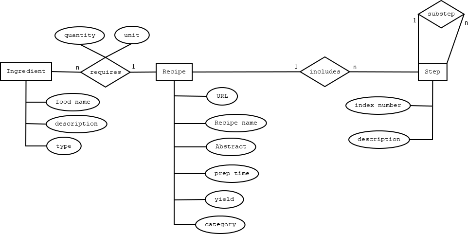

## Homework Assignment 2: Relations and relational modeling

Part 1. Let S be the set of all students enrolled for Fall semester 2019 at the School of Information Sciences.

Question 1. Write, in English, a precise definition for a specific
relation over S that is *symmetric.* Explain in no more than three
sentences why that particular relation is symmetric.

Question 2. Same instructions as Question 1, but define a specific
*antisymmetric* relation, and justify that property. This should be a
different relation than those you've described so far.

Question 3. Same instructions as Question 1, but define a specific
*reflexive* relation, and justify that property.  This should be a
different relation than those you've described so far.

Question 4. Same instructions as Question 1, but define a specific
*irreflexive* relation, and justify that property.  This should be a
different relation than those you've described so far.

Question 5. Same instructions as Question 1, but define a specific
*transitive* relation, and justify that property. This should be a
different relation than those you've described so far.

Part 2. Consider the following ER Diagram for recipes. Note that the
only attribute shown that uniquely defines an entity instance is the
URL attribute for recipes; "index number" identifies the ordinal
position in a sequence of steps, and two or more ingredients may have
the same name. Preparation times are in minutes. Recipe categories
include dessert, appetizer, entree, etc. Food types include nut, meat,
etc.

\ 

Question 6. Translate this diagram into a relational schema, following
the guidelines discussed in class. Define your own primary key fields.

Question 7. Write relational algebra expressions (not SQL syntax) for
the following queries, using the relational schema you wrote for the
Question 6:

a. Names and URLs for recipes that can be prepared in less than thirty
minutes that require eggs (but no more than three eggs).

b. Names, and preparation times for dessert recipes that require no nuts.

Part 3: Optional extra credit.  Define relation $Q$ over set $S$ of
students as $\langle s,t \rangle \in Q$ if students $s$ and $t$ are
enrolled together in a Fall 2019 semester class. Is $Q$ an
*equivalence relation* or not? Review each of the criteria for
equivalence relations, and explain in careful English how $Q$ either
meets or fails to meet each criterion.

