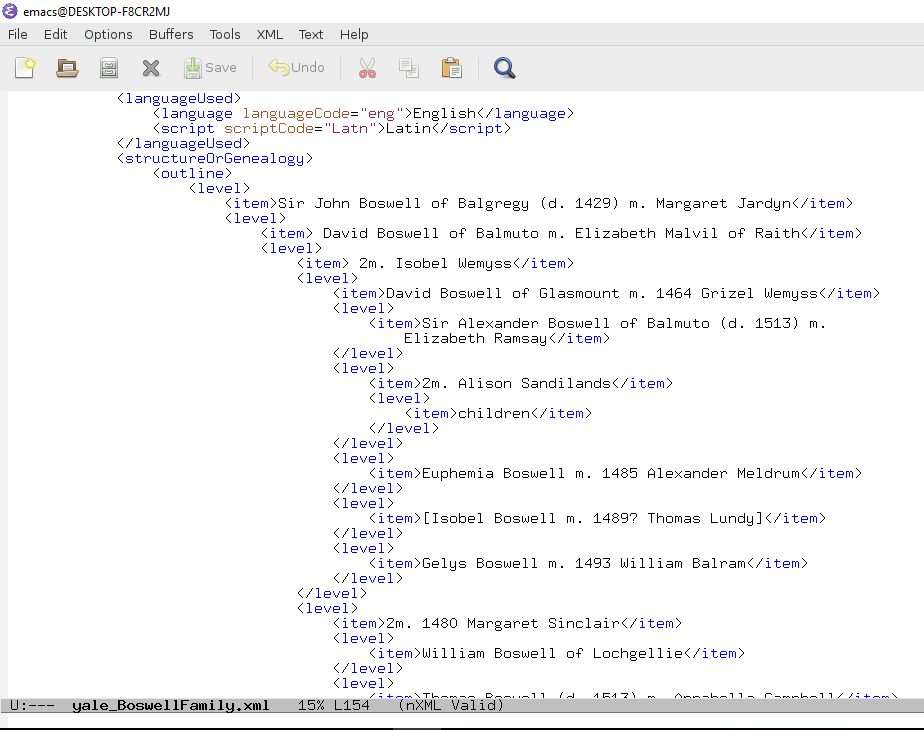

The focus for this assignment is an authority record for the Beinecke
Rare Book and Manuscript Library at Yale. It is encoded in an
XML-based artificial language called EAC-CPF (for Encoded Archival
Context - Corporate bodies, Persons and Families). The complete file
can be retrieved at [this
link](http://eac.staatsbibliothek-berlin.de/fileadmin/user_upload/schema/yale_BoswellFamily.xml)
and viewed with any text editor. But most editors won't show you the hierarchical structure, so we
direct your attention to the fragment illustrated below:

\ 

For this assignment you are to consider what it would mean for an
expression in EAC-CPF to be correct, and to what extent a
denotation-based semantics like the one presented in the Bach chapters
would be useful in formalizing the meaning of EAC-CPF. Answer
the following questions (with each answer 1-2 paragraphs long). Upload
your assignment here.

1. Consider the `<level>` element nested within the
   `<structureOrGenealogy>` element. Would it make sense for a
   `<level>` to denote a truth value? What other kinds of things
   besides a truth value could be the referent of a `<level>` in this
   language?
2. Bach's *PC* semantics illustrates Frege's [principle of
   compositionality](https://en.wikipedia.org/wiki/Principle_of_compositionality),
   which states that the meaning of a language expression is based on
   the meaning of its constituents. For example, the meaning of a
   disjunction in *PC* is based on the meaning of each disjunct, and
   the meaning of an atom is based on the meanings of the predicate
   and terms. In EAC-CPF, how would you recommend that the meaning of
   a `<level>` element be determined by the meanings of the elements
   nested within it?
3. How does the truth of a level element depend on the meaning of
   notation like `m.`, `2m.`, and `d.`?  Can we use a denotative
   semantics to account for their meanings? If not, please explain why
   that won't work, and if we can, then propose one or more categories
   of entity that those abbreviations could denote.
4. Does the semantics of predicate logic give us any help in
   accounting for the meaning of EAC-CPF? Try expressing three facts
   from this genealogy in predicate logic.
5. Where in the EAC-CPF fragment can we find an expression that could
   correspond to a modal operator like the $\Box$ or $\Diamond$
   operators? Suggest a modal logic expression that would correspond
   to one of the statements in this authority record.